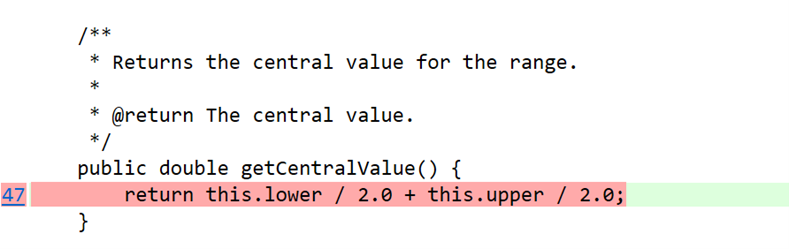
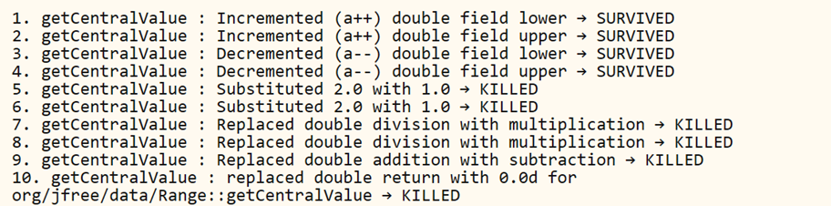
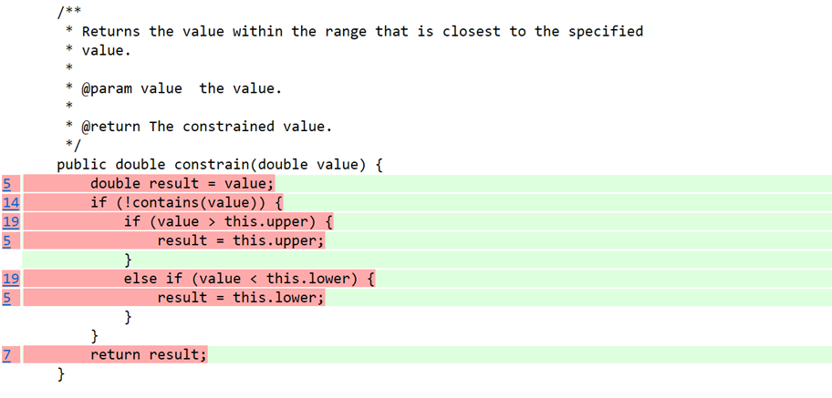
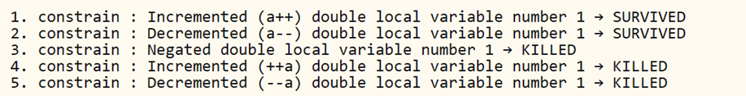
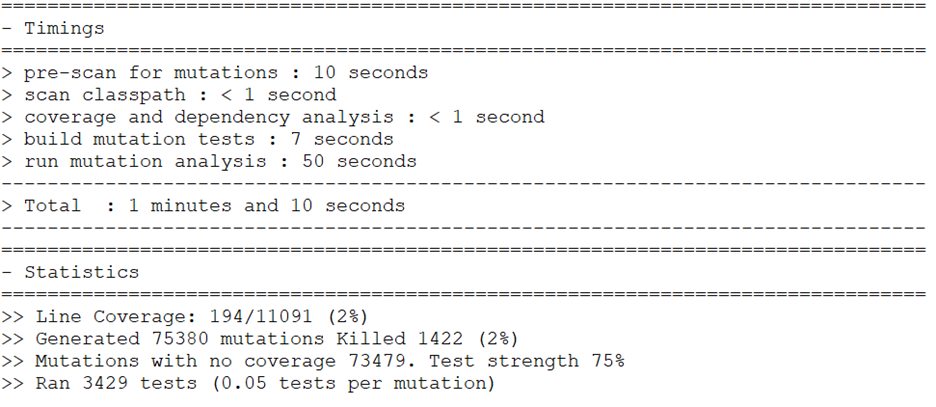
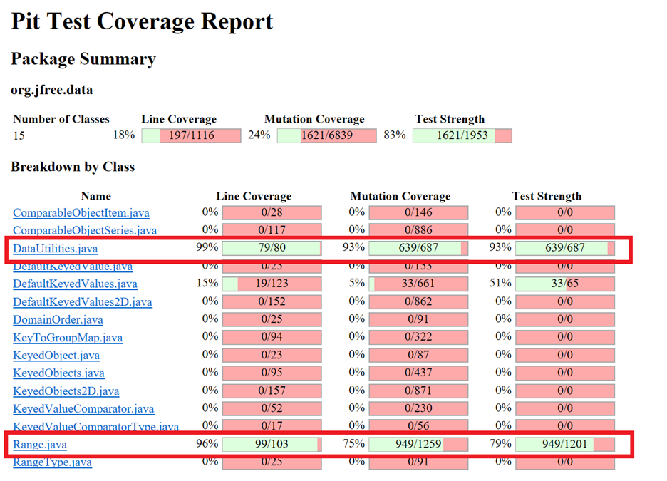

**SENG 637 - Dependability and Reliability of Software Systems**

**Lab. Report \#4 – Mutation Testing and Web app testing**

| Group \#:      | 15 |
| -------------- | --- |
| Student Names: |Mehrnaz Senobari|
|                |Sina Salimian|
|                |Sahar Hajjar Zadeh|
|                |Zar Safari|
|                |Fatemeh Ghaffarpour|
|                |Alireza Esmaeili|

# Introduction

Mutation testing is important for checking how good our test suites are. It works by making small changes, called mutants, in the software code to test if the test suite can find these changes. We focused on using mutation testing for the `Range` and `DataUtilities` classes from the JFreeChart library, which we already worked on in Assignment 3.

Before starting with mutation testing, we needed to make sure that our test suite was working well and that all test cases were passing. We found some problems in our `RangeTest.java` and `DataUtilitiesTest.java` test cases. Fixing these problems was important to make sure our test suite was ready for mutation testing.

We also did GUI and web testing using Selenium, a tool for automating web browsers. This part of our work involved making and automating test scenarios for web functionalities. Working with Selenium was a new experience that taught us a lot about web testing.

This report talks about how we improved our test suites with mutation testing and our experiences with GUI and web testing using Selenium. We will share the steps we took, the challenges we faced, and what we learned about making our testing better.

# Analysis of 10 Mutants of the Range class 

In this part of our report, we look closely at some changes, called mutants, that were automatically made to the `Range` class. We concentrated on mutations in two methods: `getCentralValue` and `constrain`.

## Analysis of Mutations for `getCentralValue` Method

The `getCentralValue` method is designed to calculate the middle number of the range. It works by adding half of the lowest number of the range to half of the highest number.

  

*Figure1: Original `getCentralValue` method.*

Some of the mutants we found in this method include:

1. **Changing Division to Multiplication**: One mutant replaced the division by 2.0 with multiplication. This made the method give back a number much bigger than the actual central value, which our tests were able to catch.
   
2. **Swapping Addition and Subtraction**: Another mutant changed the addition to subtraction. Instead of adding the halves of the lower and upper values, it subtracted them, which would result in an incorrect value if the range did not center around zero.

3. **Altering the Numeric Value**: A mutant changed the `2.0` to another number like `3.0`. This would alter the calculation and not return the correct central value.

Each of these mutants helped us see if our tests for `getCentralValue` were strong. Our tests needed to make sure that no matter what changes were made to the method, they could detect if the central value was not being calculated correctly. 

In the following sections, we will also discuss the `constrain` method and the mutants generated for it.

In examining the `getCentralValue` method from the `Range` class, we observed a total of 47 mutants generated by the mutation testing framework. For the purpose of this report, we are detailing the first ten mutants to understand their impact.

The mutants numbered 1 through 4 were notable because they continued to pass the test suite—these mutants are labeled as "survived." They involved slight adjustments to the `lower` and `upper` boundaries of the range, either increasing or decreasing them. To ensure these mutants can be caught in future tests, we would need to implement additional assertions that specifically check the `lower` and `upper` boundaries after the `getCentralValue` method is invoked.

 

*Figure 2: List of mutations for `getCentralValue` method.*

Mutants 5 and 6 were successfully "killed" by the existing tests. These mutants involved changing the divisor from 2.0 to 1.0, which led to incorrect calculations of the central value. Our current test cases were effective in identifying these incorrect outputs, demonstrating their ability to catch critical errors.

The next set of mutants, 7 through 9, involved swapping the arithmetic operations—from division to multiplication and addition to subtraction. These changes fundamentally altered the logic of calculating the central value, resulting in wrong outputs. Our test suite was robust enough to detect these errors, thereby "killing" these mutants.

## Analysis of Mutations for `constrain` Method

The `constrain` method ensures that any given value falls within the specified range. If the value is outside the range, the method adjusts it to the nearest range boundary.

 

*Figure 3: Original `constrain` method code snippet.*

Out of 74 mutations generated for this method, we're focusing on the first five to understand their implications.

Mutations 1 and 2, which respectively incremented and decremented a local variable, were not caught by our tests — these mutants "survived." To address this in future tests, we could pass in values equal to the range's lower or upper boundaries to check the method's accuracy.

The next three mutants, numbered 3, 4, and 5, were "killed" — meaning our current test cases successfully identified the errors. These included a mutation that negated the local variable's value, and two that altered the variable before the method's logic took place. Each of these changes led to incorrect outputs, demonstrating that our tests are effective at catching such issues.

 

*Figure 4: List of mutations for `constrain` method.*

This part of our analysis highlights where our test suite is effective and where it could be improved. By learning from the survived mutations, we can create additional tests to further strengthen our suite.

# Report all the statistics and the mutation score for each test class

## Initial Mutation Statistics from Assignment 3

In our initial mutation testing based on the test code from Assignment 3, we gathered the following statistics:

  
*Figure 5: Initial mutation testing timings and statistics.*

The mutation testing process was swift, with the entire run completing in just over a minute. The detailed coverage for `DataUtilities.java` and `Range.java` classes is highlighted in the image below:

  
*Figure 6: Line and mutation coverage report from Assignment 3.*

This initial analysis showed that the mutation coverage for `DataUtilities.java` and `Range.java` stood at 88% and 62%, respectively. This indicated a robust set of tests for `DataUtilities.java` but pointed towards potential room for improvement in the `Range.java` test suite.

## Improved Mutation Statistics for Assignment 4

Following enhancements to our test code in Assignment 4, we saw a significant improvement in our metrics:

  
*Figure 7: Enhanced mutation testing timings and statistics.*

The new timings show a similar performance in the execution speed of the mutation testing process. However, the updated statistics display a marked improvement:

  
*Figure 8: Line and mutation coverage report from Assignment 4.*

The mutation coverage post-enhancement for the classes `DataUtilities.java` and `Range.java` climbed to 93% and 75%, respectively. Our efforts to refine the tests for the `Range.java` class yielded a 13% increase in mutation coverage. However, for `DataUtilities.java`, the mutation coverage increase was capped at 5%, likely due to the presence of equivalent mutants. These mutants behave similarly to the original code, making them difficult to detect and "kill" through testing, as depicted in the image below.

In conclusion, the mutation testing exercise not only strengthened our test suites but also highlighted the challenge equivalent mutants pose to accurately measuring the real-world effectiveness of our tests.

## Adding More Test Cases to Increase Mutation Score

To enhance our mutation coverage, we meticulously analyzed the PIT test coverage report from Assignment 3. We focused on identifying why certain mutants survived and then developed targeted test cases to "kill" them.

### Improvements to `DataUtilities.java`

We noted that for the `calculateColumnTotal` and `calculateRowTotal` methods, some mutants were surviving because they either repeated or skipped items by adjusting the loop's counter. To address this, we added test cases that invoked these methods with an array where three consecutive numbers were the same, ensuring the method's correctness across repeated values.

For the `getCumulativePercentages` method, mutants that incorrectly handled null values were surviving. We introduced test cases containing null items, which successfully killed these mutants by verifying the method's robust handling of such cases.

Despite our efforts, we reached a point where additional test cases could not improve the mutation score. This was due to the presence of equivalent mutants that did not affect the code's functionality, such as altering local variables after their final use or adjusting loop conditions without changing the outcome.

### Enhancements to `Range.java`

For eight methods involving the lower and upper boundaries of the range, new test cases were added to ensure these values remained unchanged after method execution. Here's the breakdown of new test cases for each method:

- `isNaNRange`: Added 5 new test cases
- `hashCode`: Added 2 new test cases
- `intersects`: Added 7 new test cases
- `constrain`: Added 3 new test cases
- `scale`: Added 1 new test case
- `equals`: Added 1 new test case
- `combineIgnoringNaN`: Added 1 new test case
- `toString`: Added 1 new test case

These new test cases were designed to cover scenarios previously untested. By doing so, we were able to raise the mutation coverage significantly for the `Range.java` class.

# Analysis drawn on the effectiveness of each of the test classes

# A discussion on the effect of equivalent mutants on mutation score accuracy

## Effect of Equivalent Mutants on Mutation Score Accuracy

Equivalent mutants are changes in the code that don’t actually change what the code does. Because of this, our tests can't find and fail them, which means we can't "kill" these mutants with any test.

For example, if we change something in a method after it has already given us the answer (like after the `return` in `hashCode` method), it won't make a difference. It's like making a change to a part of a machine that isn't connected to anything—it won't affect how the machine works.

These mutants that don't change anything are called equivalent mutants. They make our mutation score look lower because it seems like our tests are missing something, but actually, those parts of the code just don't matter. It's important to remember this when we look at our mutation scores because it helps us understand that sometimes a score isn't perfect just because of these uncatchable changes.

# A discussion of what could have been done to improve the mutation score of the test suites

# Why do we need mutation testing? Advantages and disadvantages of mutation testing

# Explain your SELENUIM test case design process

# Explain the use of assertions and checkpoints

# how did you test each functionaity with different test data

# How the team work/effort was divided and managed

# Difficulties encountered, challenges overcome, and lessons learned

# Comments/feedback on the assignment itself
